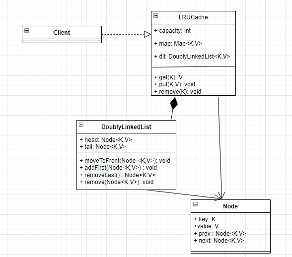

## Design LRU Cache

LRU - Least recently used - 
Cache - means something where we can add or fetch data in the O(1) time complexity and 
where we can either fetch or add any key value pair

We need to build a cache , where if we add any key value pair data structure - we should get it in O(1) TC and 
when the capacity of cache is full we have to evict/remove the least recently used key value pair

Example : Suppose our cache's capacity is 3 and for now we can have only 2 operations: get(key) and put(key, value)
put(1, A) // cache : {1:A}
put(2, B) // cache : {1:A, 2:B}
put(3, C) // cache : {1:A, 2:B, 3:C} -- capacity is full
get(1)    // access key 1 -> makes it most recently used
put(4, D) // cache : {3:C, 1:A, 4:D} -- removed 2,B as its least recently used

## Functional Requirements: 
    1. Supports get(key) operation - should return value if key exists, else -1
    2. Supports put(key, value) operation - inserts new key, value pair and updates the value of existing key
    3. If cache is above its capcacity - it evicts the most recently used item
    4. Both get and put operation should update the recency of an updated item
    5. Keys and values should be generic provided keys are hashable

## Non Functional Requirements:
    1. Time complexity - O(1) - for both get and put operation
    2. The implementation should be thread safe for use in concurrent environments
    3. Design should be modular and follows OOPS principles
    4. The internal data structure should be optimized for space and memory

## Design Ideas:
1. We need a key based lookup for cache reads and updates -- use a HashMap - it takes O(1) for lookup and update
2. We need fast ordering to track item usage and enforce eviction policy -- we can use a doubly linked list
   > Should move LRU object to the back of cache in O(1) time
   > Should move most recently used object to the start or front
   > Inserts new objects to the front - marking it most recently used
   > Perform all operations in O(1) TC

## Class Definitions

Node<K,V> - 
    key: K, 
    value: V, 
    prev: Node, 
    next: Node
DoublyLinkedList<K,V> - 
    head: Node, 
    tail: Node,
    -----------------------------
    moveToFront(Node<K, V>): void
    addFirst(Node<K, V>): void
    removeLast() : Node<K,V>
    remove(Node<K,V>): void
LRUCache:
    capacity: int
    map: Map<K, Node<K,V>>
    dll : DoublyLinkedList<K, V>
    ---------------------------
    remove(K): void
    get(K): V
    put(K,V): void

## Class Relationships:

Composition - (HAS-A)
1. LRU cache has a DoublyLinkedList
2. LRU cache has a HashMap

Association - (USES-A)
1. LRU cache uses a Node
2. DoublyLinkedList uses a Node

## Class Diagram: 

