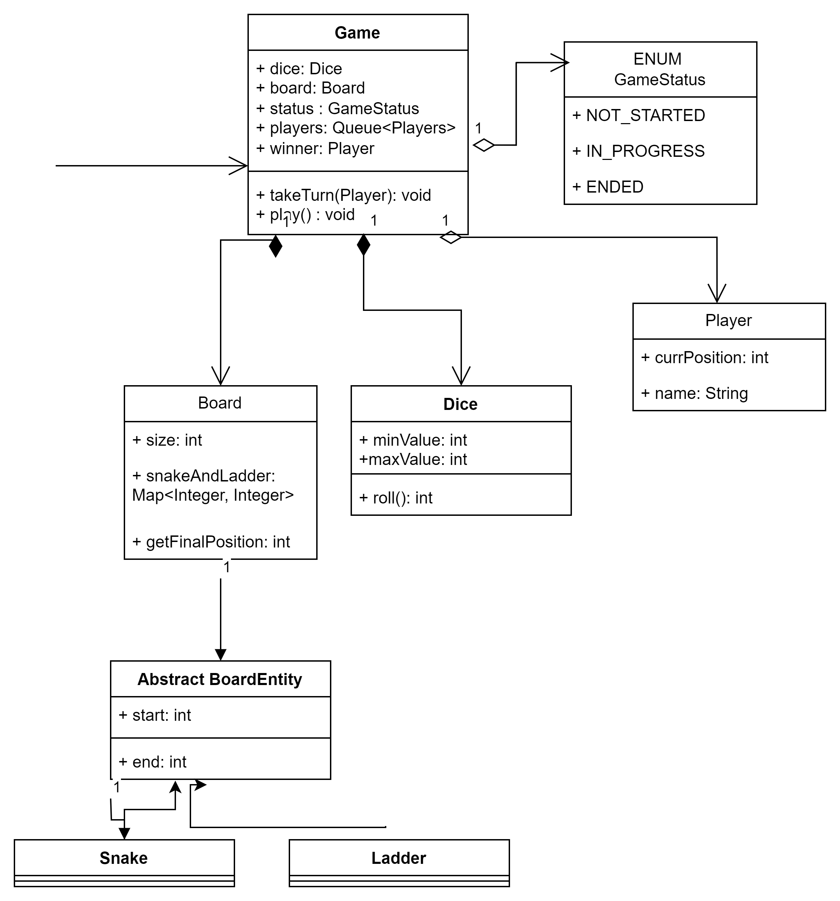

## Requirements:

### Functional Requirements:
The main requirements of Snake and Ladder Game would be:
1. _**Game**_ is played with standard _**10*10 matrix board**_
2. Support configuration of snake and ladder with flexible _start and end positions_
3. **_Snake_** would send player back to the _lower numbered squares_ and **ladder** _moves the player forward_
4. Allow **_multiple players_** and minimum of two and turn rotation should be in round-robin format
5. Simulate the rolling of **_Dice_** with random value between 1 and 6 & if it player gets a 6, it gives them extra chance
6. A player must roll the exact number to land the _100th cell_, to **_win the game_**
7. Multiple players can occupy the same **_cell_** at the same time

### Non-functional Requirements:
1. Modularity: System should follow OOPS principles with separation of concerns between each module
2. Extensibility: The design should allow future improvements as a custom board size of diff types of dices
3. Maintainability: The code base should be clean, easy to extend and readable
4. User Feedback: The system should provide clear console output after each turn indicating 
   4.1 Player movement
   4.2 Dice rolls
   4.3 snake or ladder interaction
   4.4 current positions

Board - size, snakesAndLadders: Map<Integer, Integer>
Cell - int value
Board Entity<<Interface>> [startPosition, endPosition]:
    Snake - [startPosition, endPosition]
    Ladder - [startPosition, endPosition]
Player - name: String, Identifier[Colour], currentPosition: int
Game - GameId, Dice, Board, players: Queue<Player>, winner: Player, takeTurn(Player): void, play(): void
    GameState - {IN_PROGRESS, ENDED, INITIALIZED, ABORTED;}
Dice - rollDice() : give an int value between 1 and 6
start_position - configurable
end_position - configurable

## Class Relationships:
    
    ### Composition (STRONG : has-a kind of relationship)
    1.  Game has a board- board's existence only depend on Game's instance
    2.  Game has a dice - the dice is created and owned by Game
    
    ### Aggregation (WEAK : has-a kind of relationship)
    1.  Game has a collection of players - but player's lifecycle is not controlled by Game, Game just uses it
    2.  Board - Board Entities - entities are created outside the Board and Board just uses it
    
    ### Association (is-a kind of relationship)
    1. Game class uses a Queue<Player> to manage the player's turn in FIFO
    2. Board uses a Map<Integer, Integer> to efficiently look at the start and end positions of snakes and ladders

    ### Inheritance ("is-a" kind of relationship)
    1.  Snake is a BoardEntity
    2.  Ladder is a BoardEntity

## Key design principles scope:

### Facade : The Game class can act as a central entry point. 
            It serves as Facade and provide simplified interface like -
            createGame(List<Players>), playGame(Game, playerId) and 
            hides the complex interaction between Game, Board, Dice, Snake, Ladder and Player

### Builder : The Game class uses a nested static Builder class to construct Game objects

### Template Method Pattern : BoardEntity class and its subclass(Snake and Ladder) implicitly follow the structure of this pattern
            Base class constructor : BoardEntity (handles teh common logic of storing start and end positions)
            Subclass constructor : Snake/Ladder are for special validation logic 
                >> start > end for Snake and end > start for Ladder - effectively filling the a step of creation Template

Class Diagram: 

    

<mxGraphModel><root><mxCell id="0"/><mxCell id="1" parent="0"/><mxCell id="2" value="+ dice: Dice&lt;div&gt;+ board: Board&lt;br&gt;+ status : GameStatus&lt;br&gt;+ players: Queue&amp;lt;Players&amp;gt;&lt;br&gt;+ winner: Player&lt;/div&gt;" style="text;strokeColor=none;fillColor=none;align=left;verticalAlign=top;spacingLeft=4;spacingRight=4;overflow=hidden;rotatable=0;points=[[0,0.5],[1,0.5]];portConstraint=eastwest;whiteSpace=wrap;html=1;" vertex="1" parent="1"><mxGeometry x="270" y="136" width="160" height="84" as="geometry"/></mxCell></root></mxGraphModel>

