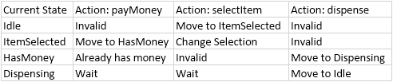

## Theoretical Foundation:
The state design pattern is a behavioral design pattern that implements **Finite State Machine (FSM)** as a collection of objects.
It allows an object (the **context**) to alter its behaviour when the internal state changes, 
effectively giving **_a way that object changes its class at runtime_**.

### Principles Addressed: 
1. OCP - Add new states without modifying existing context or state classes
2. SRP - Each state class handles its logic specific to that state
3. Elimination of "State" pollution - Logic of StateA never leaks into execution block logic of StateB

## Anatomy of the pattern:
1. Context : The interface for outside world. This maintains a reference to `ConcreteState` instance that represents the current state
2. State Interface: Defines a common interface for all the `ConcreteState` . encapsulating the behavior of particular state of Context
3. Concrete State : each subclass implement the behavior associated with the state of context

## Common Use cases: 
1. Workflow Engines: Document approval Workflows (Draft -> Review -> InProgress -> Completed)
2. Protocol stacks: TCP connection states (LISTEN, ESTABLISHED, CLOSED)
3. Games: Character behaviors - AttackMode, FleeMode, 
4. UI Components: Complex forms of buttons(Enables, Disabled, Loading, Error)

### The state transition table:

## State Design Pattern

State design pattern is a behavioral design pattern which lets the object change its behavior when its internal state changes
as if it were switching to different class as runtime

Common Use cases : 
1. Object can be one of the distinct states, each with different behavior
2. Object's behavior changes depends on current context, and that context changes over time
3. You want to avoid large, monolith if- else statements or Switch statements to check every state

Eg : Lets say a `Document` object can have various states like : `Draft`, `Ready`, `Review` or `Published` states
We might use if else statements to determine what to do, if we have to for each state, which would violate Open/Close principle

To avoid this: we use `State design pattern` by encapsulating each state into its own class and 
letting context object delegate behavior to current state.
This way each sate has its own class - easier to extend, reuse and maintain

### Understanding State design principle using an example
Imagine we are building a Vending machine.
If we think about it - Vending machine has 3 function : acceptMoney, dispense, go to idle state
At any given time vending machine can have any of the three status:
1. Idle State
2. HasMoneyState
3. ItemsSelectedState
4. DispensingState

The machine supports user facing conditions : 
selectItem(String itemCode)
payMoney(Double amount)
dispenseItem()

Each of the above method would behave differently, based on the machine's current state
calling `dispenseItem()` when machine is in `Idle state` - should do nothing as no money inserted and nothing to dispense
calling `payMoney(Double amount)` before selecting an item makes no sense, or be disallowed or queued.
calling `selectItem(String itemCode)` during `DispensingState` should be ignored

#### Naive approach
Check below Java code : 
`public class NaiveVendingMachine {
private enum State {
IDLE, ITEM_SELECTED, HAS_MONEY, DISPENSING
}

    private State currentState = State.IDLE;
    private String selectedItem = "";
    private Double insertedAmount = 0.0;

    public void selectItem(String itemCode){
        switch (currentState) {
            case IDLE:
                selectedItem = itemCode;
                currentState = State.ITEM_SELECTED;
                break;
            case ITEM_SELECTED:
                System.out.println("Item already selected");
                break;
            case HAS_MONEY:
                System.out.println("Money received");
                break;
            case DISPENSING:
                System.out.println("Currently dispensing");
            case null, default:
                System.out.println("Something is wrong...");
        }
    }

    public void payMoney(Double amount){
        switch (currentState){
            case ITEM_SELECTED:
                insertedAmount = amount;
                System.out.println("Inserted "+ amount+ " amount in vending machine");
                currentState = State.HAS_MONEY;
                break;
            case IDLE:
                System.out.println("No items selected");
                break;
            case HAS_MONEY:
                System.out.println("Money already inserted");
                break;
            case DISPENSING:
                System.out.println("Currently dispensing");
        }
    }

    public void dispenseItem(){
        switch (currentState){
            case DISPENSING:
                System.out.println("Currently dispensing...");
                break;
            case IDLE:
                System.out.println("No items selected");
                break;
            case HAS_MONEY:
                System.out.println("Dispensing item : "+selectedItem+ " ..");
                currentState = State.DISPENSING;
                try {
                    Thread.sleep(1000);
                } catch (InterruptedException e) {
                    Thread.currentThread().interrupt();
                }
                System.out.println("Item dispensed");
                break;
            case ITEM_SELECTED:
                System.out.println("Enter money first");
                break;

        }
    }

    private void resetMachine(){
        selectedItem = null;
        insertedAmount = 0.0;
        currentState = State.IDLE;
    }
}`

## Issues with above approach : 
1. Cluttered code : code is hard to read, duplicate switch statements, many statements repeated, fragile logic , and donot follow Open close principle
2. Hard to extend : Suppose we want to introduce new states like : Out_Of_Order or MAINTENANCE state - update each Switch block and add logic at multiple places and prone for bug

### Then How should we design this kind of use cases?
Answer is State pattern:  
State pattern extracts each state behavior in separate class

1. Define a `State interface` that declares the methods representing actions the `context` can perform
2. Create concrete classes each implementing `State interface` - each implements the behavior specific to the context
3. The `Context class` maintains the instance of concrete states subclass that defines its current state
4. When action is invoked on the `Context` , it delegates the action to its current state object
5. Concrete states are often responsible for transitioning the state to a new context

