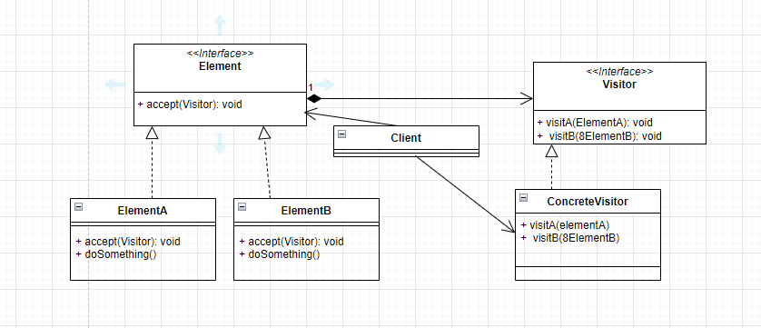
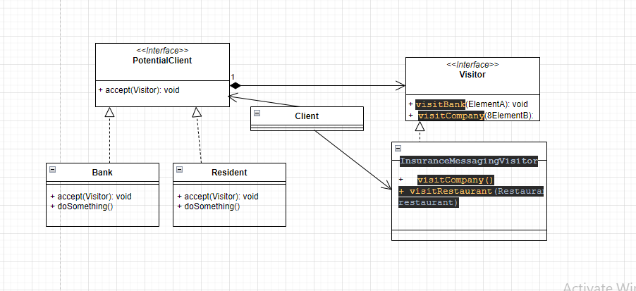

Imagine a use case where we are in a insurance company and insurance company has variety of clients
and we want to manage the diff potential class, if you see the code, 

the naive way : it works fine, 
because all diff clients have diff functionality and all of them extends the `PotentialClient` class and create right objects at runtime
but let's imagine we have new requirement, sendEmail() which we have to send to each client , but mail for different subclass will have diff stry
1. resident - medical insurance ad will be sent
2. bank - theft insurance ad mail will be sent
3. restaurant - fire insurance mail will be sent

Simple : add a sendMail() method in `PotentialClient` class and all the subclasses will implement them : But by doing this, we violated 
Single responsibility and Open/Close principle 

To cater this kind of use case : we use Visitor Design pattern

## Visitor Design pattern
This is a behavioral design pattern
It separates the behaviour on the objects on which they operate

So to do this, we create a `Visitor` interface and implement that using `InsuranceMessagingVisitor` class where we have defined messaging logic for each type of client(Bank, Resident, Company ..)
Also we use a DoubleDispatch - delegates the choosing of the proper method to the object itself, instead of client selecting the object
we will add a method `accept(Visitor visitor)` to abstract class `PotentialClient` and all its method will have to implement

